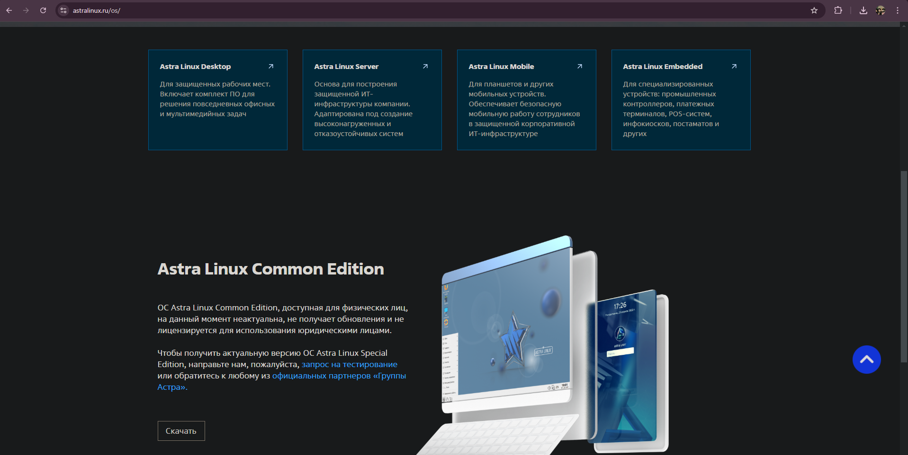
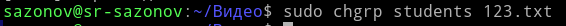

# Средства безопасности ОС Linux

**Целью данной** работы является получение базовых навыков обращения с ОС класса Linux и обучение основам обеспечения безопасности данных систем

## Содержание 

# 1 Установка ОС

Скачиваем дистрибутив Astra Linux с официального сайта:

Устанавливаем данную ОС, присваиваем имя машины "sr-sazonov":

При настройке жесткого диска воспользуемся оснасткой «Авто» и при
установке дополнительных компонентов указываем OpenSSH:

В поля «имя пользователя» вписываем фамилию Sazonov и указываем
пароль:

Настраиваем сетевой интерфейс, вводим команду sudo nano
/etc/network/interfaces:

Проводим настройку:

После настройки сетевых интерфейсов выполняем: sudo apt update, sudo
apt upgrade для получения новых списков пакетов и обновление ОС:

Проверяем работоспособность системы:

Убеждаемся, что сеть настроена правильно:

Проверяем доступность SSH:

# 2 Основная часть 

## 2.1 Описания процесса установки дистрибутива Asra Linux

Процесс установки:

Установка Astra Linux выполняется через графический интерфейс или
терминал. Выбираем язык, раскладку клавиатуры, имя машины, имя
пользователя и пароль. Затем настраиваем жесткий диск (вручную или
автоматически) и устанавливаем дополнительные компоненты, например,
OpenSSH (опционально).

Настройка сетевых интерфейсов:

- Статические записи: Редактирование файла /etc/network/interface
- Получение IP по DHCP: В файле /etc/network/interfaces указать iface eth0 inet dhcp

Обновление ОС: используем команды sudo apt update и sudo apt
upgrade.

Установка пакетов: используем команды sudo apt install\<имя_пакета\>

## 2.2 Изучение команды adduser

Создаём тестовые учётную запись student:

Создаём тестовые учётную запись auditor:

Применение для обеспечения безопасности:

Разделение учетных записей позволяет ограничить доступ к системе и
контролировать действия пользователей.

## 2.3 Изучение команд groupadd, groupmod, usermod

Создаём группы students и staff и добавляем в них созданных в предыдущем
пункте пользователей соответственно:

Применение для обеспечения безопасности:

Группы позволяют организовать управление правами доступа, что снижает
риски несанкционированного доступа.

## 2.4 Изучение утилиту passwd

Сменим себе пароль:

Сменим пароль созданным учётным записям:

Применение для обеспечения безопасности:

Регулярная смена паролей и применение сложных паролей существенно
повышают защиту учетных записей от несанкционированного доступа.

## 2.5 Устанавка mc

Устанавливаем и запускаем mc:

Изучим функционал:

- механизм поиска:

- создания файлов:

- редактирование:

- просмотр прав на файлы:

Применение для обеспечения безопасности:

Инструмент mc упрощает управление файлами, помогает быстро проверить
права доступа к файлам, обнаруживать неверно настроенные файлы и
управлять ими.

## 2.6 Изучение команды history

Увеличим размер истории:

Изменяем значения строчек HISTSIZE и HISTFILESIZE

Применение для обеспечения безопасности:

Расширенная история команд помогает в аудите действий пользователей, что
важно для расследования инцидентов и контроля за выполненными командами.

## 2.7 Изучение команд grep, cat, ls (ключи, применение)

Команда grep ищет текстовые строки в файлах:

Команда cat выводит содержимое файла на экран:

Команда ls выводит список файлов и директорий:

Применение для обеспечения безопасности:

Эти команды позволяют анализировать журналы, проверять конфигурационные
файлы и права доступа, что может помочь в обнаружении аномалий и
нарушений безопасности.

## 2.8 Изучение chmod, chown, chgrp (демонстрация применения)

Chmod изменяет прав доступа:

chown изменяет владельца и группы файла:

chgrp изменяет только группы файла:

Применение для обеспечения безопасности:

Правильное управление правами доступа предотвращает несанкционированное
чтение или изменение критичных файлов, снижая риск компрометации
системы.

## 2.9 Изучение утилиты ip

Просмотр интерфейсов:

Мониторинг состояния сети:

Просмотр таблицы маршрутизации:

Применение для обеспечения безопасности:

Утилита ip позволяет детально отслеживать состояние сети, обнаруживать
аномалии в конфигурации интерфейсов и маршрутизации, что критически
важно для выявления атак и неправильной настройки сети.

## 2.10 Изучение утилиту traceroute

Устанавливаем traceroute:

Применяем команду:

Применение для обеспечения безопасности:

Утилита traceroute помогает выявить узлы, через которые проходит трафик.

## 2.11 Изучение утилиты iptables (блокировка возможности применения утилиты ping извне)

Заблокируем возможность применения утилиты ping извне:

До применения команды:

После применения команды:

Применение для обеспечения безопасности:

Ограничение ICMP-пакетов помогает уменьшить возможности для сканирования
сети злоумышленниками.

## 2.12 Настраивание подключения к виртуальной машине по ssh, используя пароль 

Продемонстрируем возможность подключения, далее, настроим
подключение только по ключу (заблокируем возможность подключения по
паролю), продемонстрируем подключение.

Подключаемся по SSH:

Настройка подключения по ключу:

Генерация ключей на клиенте и передача публичного ключа на сервер:

Теперь есть возможность подключаться, используя ssh ключ.

Отключаем аутентификации по паролю:

После изменения настроек:

Пробуем подключиться по ssh ключу:

Применение для обеспечения безопасности:

Переход на аутентификацию по ключу значительно повышает безопасность,
так как ключи сложнее подобрать или перехватить по сравнению с паролями.

## 2.13 Работа с журналами Linux: изучение инструменты journalctl и logwatch

утилита Journalctl используется для просмотра системных журналов
(логов):

Создаём несколько подозрительных событий, например многократный
неудачный вход в систему:

Фильтруем по SSH:

Обнаружим данные события:

Применение для обеспечения безопасности:

Регулярный анализ логов с помощью journalctl позволяет обнаружить
аномальные действия, своевременно отреагировать на попытки
несанкционированного доступа и другие подозрительные события. Также логи
дают возможность провести детальный аудит действий в системе, что важно
для последующего анализа инцидентов безопасности.
